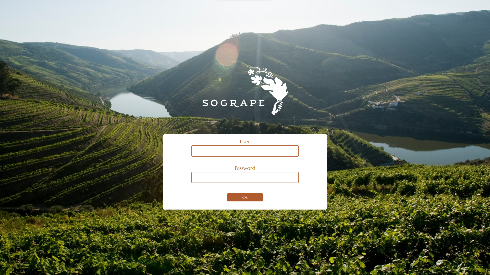
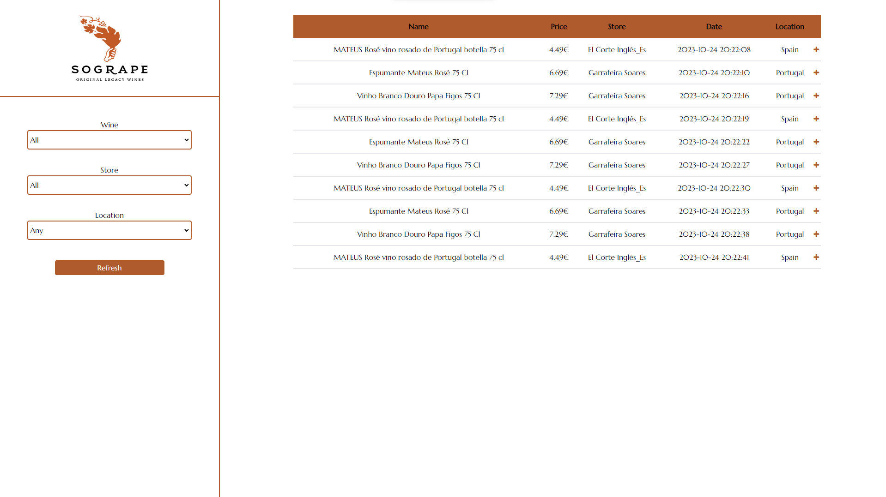

# Sogrape Webscraper


_Web scraping website developed in a 3-day period, during the Hackathon promoted by Sogrape and 42 Porto (23 - 26 Oct. 2023)._
___

### Table of contents
[Challenge]([#rocket-challenge]) · [Prerequisites](#prerequisites) · [Installation](#installation) · [Usage](#usage) · [Credits](#credits) · [License](#license)

___

</br>

# :rocket: Challenge

Implementing a web scraping system able to collect wine prices from national online stores on a daily basis, and to develop an interactive and intuitive interface to display the same data.

</br>

## Approach

Automated web scraping website that would allow Sogrape’s employees to easily compare pricing between several retailers for the same product, and to keep track of price fluctuations over time, in an automated manner.

<div>
    
    
</div>

___

</br>

# :compass: Usage
## Prerequisites

Before you begin, ensure you have met the following requirements:

- [XAMPP](https://www.apachefriends.org/index.html) installed
- [Python](https://www.python.org/downloads/) installed

</br>

## Installation

1. Clone the repository
```bash
git clone git@github.com:teresa-chow/42-hackathon-sogrape.git
```

2. Start Apache and MySQL in XAMPP

   - Launch XAMPP Control Panel
   - Click <kbd>Start</kbd> next to Apache and MySQL

3. Configure your project

   - Copy your project files to the XAMPP web server directory (usually `C:\xampp\htdocs\hack_dashboard` on Windows)
   - Edit your project configuration files if necessary

4. Install Python and required packages

   - Download and install [Python](https://www.python.org/downloads/);
   - Open the Windows command prompt
   - Navigate to your project directory
   - Install the required packages using pip

      ```bash
      python -m pip install -r requirements.txt
      ```

       or install them individually using

      ```bash
      pip install <package>
      ```

</br>

## Usage

1. Start XAMPP

   - Launch XAMPP Control Panel
   - Click <kbd>Start</kbd> next to Apache
  
2. Run an SQL server instance and use our [mydb_wine.sql](./mydb_wine.sql) file – _this will ensure you are connected to a database that our program is compatible with; it can also run on any web server/host_

3. Access your PHP website

   - Ensure XAMPP is running
   - Click <kbd>Admin</kbd> button to acces the root/index of our website

4. Run the Python code

   - Open a terminal/command prompt
   - Navigate to your project directory
   - Execute your Python script using the following command
   
      ```bash
      python main.py
      ```

5. Refresh the dashboard using the button – _all the data of the SQL will appear_

___

</br>

### Credits
Bernardo Esteves [@berestv](https://github.com/berestv)

Bruno Lopes [@brpereiraa](https://github.com/brpereiraa)

João Ramalhosa [@joaoped2-42PORTO](https://github.com/joaoped2-42PORTO)

Ricardo Santos [@rssantos342](https://github.com/rssantos342)

Teresa Chow (me)

Vinicius Vaccari [@vivaccar](https://github.com/vivaccar)
___

</br>

### License
This work is published under the terms of the [MIT License](./LICENSE).

</br>

[⬆ back to top](#sogrape-webscraper)
